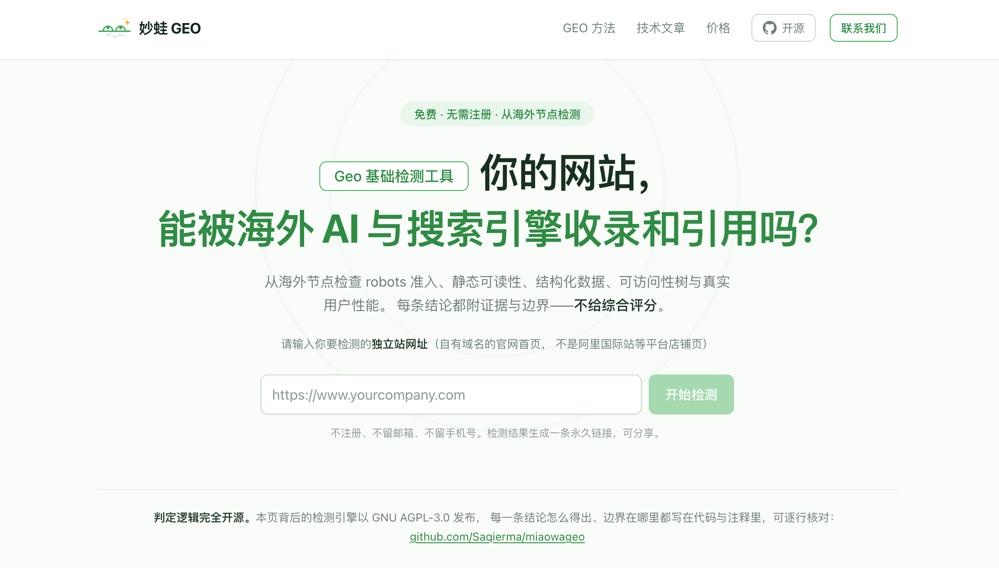

# 妙蛙 GEO · miaowageo

[](https://github.com/Saqierma/miaowageo/actions/workflows/test.yml)
[](LICENSE)
[](package.json)
[](package.json)

**免费开源的 GEO 检测工具（生成式引擎优化检测）—— 查一查，你的网站在 ChatGPT、Claude、Perplexity、Gemini 眼里到底存不存在。**

[**立即免费检测 →  miaowageo.com/geocheck**](https://miaowageo.com/geocheck)

[English below ↓](#miaowageo--free-open-source-geo-checker)

> 无需注册、不留邮箱、不留手机号。从海外检测点发起，27 项技术检查，每一条结论都附证据与边界。



📂 **[看 8 份真实的检测报告 →](cases/)** —— 不是构造的样例，是线上跑过的真实站点。

---

## 一、现状：一场已经开始、而大多数企业还不知道的迁移

买家提问的入口，正在从搜索框搬到对话框。

过去他们打开 Google 搜 `stainless steel pipe supplier`，翻三页找供应商。现在他们直接问 ChatGPT：「帮我找几家可靠的不锈钢管供应商，对比一下」——然后 AI 给出三五个名字，**买家只看这三五个**。

第四名和第四百名，没有区别。

这件事对中国的中小企业，尤其是外贸企业，意味着两个坏消息：

**第一个坏消息：大多数人还不知道 GEO 是什么。**

我们跟大量做外贸的中小企业聊过。他们知道 SEO，做过竞价，投过独立站广告。但当被问到「你的网站现在能不能被 ChatGPT 引用」时，几乎所有人的第一反应是——**这个问题我从来没想过，也不知道去哪里看**。

不是他们不重视。是这件事**没有一个能自己动手查的入口**。Google Search Console 不会告诉你 ChatGPT 有没有抓你，百度统计更不会。

**第二个坏消息，比第一个严重得多：很多企业的官网，已经在技术层面把 AI 挡在门外了，而他们完全不知道。**

这不是危言耸听。它可能只是：

- `robots.txt` 里一行 `Disallow: /`，是三年前建站公司随手写的，没人再看过
- 一层 WAF / CDN 的机器人防护，把所有「非浏览器」的访问一律返回 403 —— 而 GPTBot、ClaudeBot、PerplexityBot 恰恰都是自报身份的非浏览器访问
- 整站内容靠 JavaScript 渲染，静态 HTML 里一个字都没有
- 页面连 `<title>` 和 `description` 都缺，AI 拿不到任何可引用的结构化信息

**这些问题的共同点是：从人的浏览器里看，网站好得很。** 打开正常、图片正常、表单能提交。老板看不出任何问题，技术也不会主动报。

只有当你**用 AI 爬虫的身份去访问一次**，才会看见那扇一直关着的门。

这个工具做的就是这件事。

---

## 二、什么是 GEO？和 SEO 有什么区别？

**GEO（Generative Engine Optimization，生成式引擎优化）**，指让你的网站内容能够被生成式 AI 引擎——ChatGPT、Claude、Perplexity、Gemini、Copilot、豆包、Kimi 等——**抓取、理解、并在回答中引用**的一整套优化工作。

| | 传统 SEO | GEO（生成式引擎优化） |
| --- | --- | --- |
| 目标 | 在搜索结果页排得更靠前 | 在 AI 生成的答案里**被提及、被引用** |
| 竞争位 | 第一页十个位置 | 通常只有 **3–5 个** 来源被引用 |
| 关键爬虫 | Googlebot、Baiduspider | **GPTBot、OAI-SearchBot、ClaudeBot、PerplexityBot、Google-Extended** |
| 准入文件 | `robots.txt`、`sitemap.xml` | `robots.txt` + **`llms.txt`**、`agents.md`、`/.well-known/ucp` |
| 内容形态 | 关键词与外链 | **可被机器直接摘录的结构化事实** |
| 失败的样子 | 排在第 5 页 | **完全不出现** |

一句话概括区别：**SEO 输了是排名靠后，GEO 输了是根本不存在。**

而这两件事有一个共同的前提：**AI 得先能进得来。**

进不来，后面所有内容优化、Prompt 运营、品牌建设都是零。所以 GEO 的第一步永远是**技术准入检测**——也就是这个工具做的事。

---

## 三、这个工具是什么

**妙蛙 GEO 检测**是一个免费、无需注册的 GEO / AI 搜索准入检测工具。输入网址，它会从**海外检测点**发起真实请求，回答一个具体的问题：

> 海外的 AI 引擎与搜索引擎，现在能不能抓到、读懂、并引用你的网站？

### 立即使用

### 👉 **[https://miaowageo.com/geocheck](https://miaowageo.com/geocheck)**

不注册、不留邮箱、不留手机号。检测结果会生成一条可分享的永久链接。

### 为什么必须从海外检测点测

这是一个容易被忽略、但会导致结论完全错误的细节。

从中国大陆访问一个海外站点，你量到的是**跨境链路的状态**：延迟、TLS 握手、CDN 边缘节点全都不同，很多站点还对大陆 IP 有单独的地域策略。而 GPTBot、ClaudeBot 这些爬虫是从海外数据中心出发的——**它们看到的东西和你在国内看到的不是一回事。**

用国内的检测点去测海外可见性，量到的是你自己的网络，不是 AI 的视角。

---

## 四、它到底检查什么

**27 个计分项，分 6 组。** 全部是可验证的技术事实，不含任何主观打分。

### 1. AI 搜索准入检测（robots.txt 逐个爬虫判定）

对 **13 个** AI 与搜索爬虫**逐一**按 RFC 9309 求值——不是笼统看一句 `User-agent: *`，而是分别判定每一个：

| 爬虫 | 被封禁的影响 | 计分 |
| --- | --- | --- |
| **OAI-SearchBot** | 选择退出的站点不会出现在 ChatGPT 搜索答案中 | ✅ |
| **PerplexityBot** | 影响 Perplexity 自有索引的收录 | ✅ |
| **ClaudeBot** | 影响 Claude 检索 | ✅ |
| **Bingbot** | Microsoft Copilot 一切以 Bing 索引为前提 | ✅ |
| **Google-Extended** | 影响 Gemini 的 grounding，**不影响**传统 Google 排名 | ✅ |
| **ChatGPT-User** | 仅影响用户主动触发的实时抓取 | ✅ |
| **Claude-User** | 同上 | ✅ |
| **Perplexity-User** | 同上 | ✅ |
| **Applebot** | 影响 Siri 与 Spotlight | ✅ |
| GPTBot | 仅训练语料采集，**不影响** ChatGPT 的引用资格 | 参考项 |
| Applebot-Extended | 仅训练语料采集 | 参考项 |
| Amazonbot | 训练语料 | 参考项 |
| CCBot | Common Crawl 训练语料 | 参考项 |

> **为什么 GPTBot 只是参考项而不计分？** 因为它只用于采集训练语料，封禁它**不影响**你的内容出现在 ChatGPT 的搜索式回答里——那是 OAI-SearchBot 的事。把两者混为一谈，是目前大量 GEO 文章共同的错误。封禁 GPTBot 是很多企业深思熟虑后的版权决定，我们**呈现事实，不替你判对错**。

同组还包括：`canonical` 标签、`noindex` 声明、`sitemap.xml` 可达性。

### 2. 页面元信息与国际化

`<title>` · `meta description` · `<h1>` 结构 · `<html lang>` · **`hreflang`** · 移动端 viewport · Open Graph · 图片 `alt` 覆盖率

> 外贸站尤其要看 `hreflang`：多语言站点缺了它，Google 与 AI 都无法判断该把哪个语言版本给哪个地区的用户。

### 3. 静态可读性

不执行 JavaScript 时，页面能读到多少正文。**这是 GEO 里最致命也最常见的问题**——大量用 Vue / React 做的官网，静态 HTML 里只有一个空的 `<div id="app">`。人打开看得见，爬虫拿到的是一片空白。

### 4. 结构化数据

JSON-LD 与主体类型（Organization / Product / Article 等）、`sameAs` 声明。这是 AI 能直接摘录的事实来源。

### 5. AI 代理可用性

- **`llms.txt`** —— 面向大语言模型的站点说明文件
- **`agents.md`** —— 面向 AI 代理的操作说明
- **`/.well-known/ucp`** —— Universal Commerce Protocol 端点
- **可访问性树** —— 用真实无头浏览器构建，AI 代理靠它理解页面结构

### 6. 性能

Google PageSpeed Insights 移动端性能分、CrUX 真实用户字段数据、累积布局偏移（CLS）。

### 7. User-Agent 差分矩阵：同一时刻，换七种身份各访问一次

`robots.txt` 写了允许，不等于爬虫真的进得来。**大量拦截发生在 CDN 与 WAF 那一层，
`robots.txt` 根本管不着。** 而这种拦截从浏览器里完全看不出来——你的网站在你眼里一切正常。

所以我们对同一个页面、**同一台机器、同一个出口 IP、同一个时刻**，只改 User-Agent，
串行发七个请求：

| 身份 | 它代表什么 |
| --- | --- |
| Chrome | 基线：真人用浏览器看到什么 |
| curl | 泛化的非浏览器客户端 |
| **Googlebot** | **对照组（关键，见下）** |
| GPTBot | OpenAI 的训练与抓取爬虫 |
| OAI-SearchBot | ChatGPT 搜索的抓取爬虫 |
| ClaudeBot | Anthropic 的爬虫 |
| PerplexityBot | Perplexity 的爬虫 |

变量只有一个，所以结论很硬：**有身份被单独挡下，说明拦截就是按客户端身份做的。**

这是 2026-08-13 对 `nytimes.com` 的一次真实测量：

| 以什么身份访问 | 服务器回应 |
| --- | --- |
| Chrome（普通浏览器） | `200` |
| curl（泛化非浏览器客户端） | `200` |
| Googlebot（对照） | `200` |
| OAI-SearchBot | **`403`** |
| GPTBot | **`403`** |
| ClaudeBot | **`403`** |
| PerplexityBot | **`403`** |

> 判定：**该站点存在针对 AI 爬虫的准入规则。** 识别出的厂商：Fastly。

#### 为什么必须有 Googlebot 这个对照组

这是这项检查里最要紧的一个设计，也是我们**唯一一处主动给自己找麻烦**的地方。

我们的检测点不在 OpenAI、Anthropic 公布的爬虫 IP 段里。Cloudflare 的 Verified Bots
这类机制会做反向 DNS 校验，**正确地**拒绝我们这个未经验证的 GPTBot 声明——
而真正的 GPTBot 会被放行。

也就是说，**「我们的 GPTBot 探针拿到 403」并不能直接证明真 GPTBot 被拦。**
不处理这一条，这个功能会系统性地冤枉一批配置完全正确的网站。

Googlebot 当对照能把两种情况分开——几乎没有人会故意封 Googlebot：

| Chrome | Googlebot | GPTBot | 能下的结论 |
| --- | --- | --- | --- |
| 200 | 200 | **403** | **确实存在针对 AI 爬虫的规则。**结论扎实：若做身份校验，仿冒的 Googlebot 也会一起被拦 |
| 200 | **403** | **403** | 该站在做**已验证机器人**校验，拦的是「未经验证的声明」。**真 GPTBot 可能进得去，我们测不出来**——报告里会明说无法判定 |
| 200 | 200 | 200 | 这一层没有拦截 |
| **403** | — | — | 连普通浏览器都进不来，多半是 TLS 指纹或 JS 质询。这张矩阵在这种站上测不出东西，报告里也会明说 |

第二行和第四行都会**如实报告「我们无法判定」**，而不是给一个看起来很确定的结论。
这与本项目「没测到 ≠ 不合格」是同一条原则。

判定逻辑在 [`src/probe/ua-matrix.mjs`](src/probe/ua-matrix.mjs)，四种组合各有测试守着。

#### 认出 CDN / WAF 厂商，把「要找开发」变成「点这三下」

报告里最没用的一句话是「这项要找开发」。而绝大多数 AI 爬虫拦截来自 Cloudflare、
Akamai、阿里云 WAF 这类**有固定后台、菜单路径明确**的产品——认出厂商，就能直接给路径。

指纹是纯函数，**零额外请求**，读的就是上面七个探针已经拿到的响应头
（[`src/probe/waf-fingerprint.mjs`](src/probe/waf-fingerprint.mjs)）。这一项**不计分**：
用了 Cloudflare 既不加分也不扣分，它只是「怎么改」这条信息的载体。

两条自我约束：

- **认不出厂商时说「未能识别」，不猜。** 没命中可能是没用这类产品、用了但关了标识头、
  或者是我们还不认识的厂商——这三种从外部分辨不出来。
- **没核实过菜单路径的厂商，不编路径。** 把用户送进一个不存在的菜单，比诚实地说不知道更糟。

### 真实报告长什么样

[`cases/`](cases/) 目录里有 **8 份真实的检测报告**，包括：

| | |
| --- | --- |
| [整站把检测器挡在门外](cases/01-fully-blocked.md) | 26 项里 22 项无从判定，而站点在浏览器里完全正常 |
| [按 User-Agent 拦截](cases/02-blocked-by-user-agent.md) | 抓取器 403，**同一台机器上的无头浏览器却进得去** |
| [大型 B2B 平台](cases/05-globalsources.md) | 未通过项比多数中小外贸站还多 |
| [本工具自己的站点](cases/08-miaowageo.md) | **包括它自己没通过的那一项** |

用户提交的站点已匿名（只换域名，其余数据一字未改），理由写在 [`cases/README.md`](cases/README.md#关于匿名)。

> 这 8 份报告生成于 UA 差分矩阵上线之前，所以里面写的是「26 项」而不是现在的 27 项，
> 也没有那张矩阵表。它们是**当时的真实测量**，我们不回头改数字。

---

## 五、三条我们不肯让步的原则

一个检测工具最容易做的事，是把复杂的现实压成一个好看的数字。我们拒绝这么做。

### 原则一：**不给综合评分**

市面上几乎所有检测工具都会给你一个 0–100 的总分。我们一个都不给。

因为综合分会把三种性质完全不同的东西混进同一个数字：**必要条件**（robots.txt 封了 ClaudeBot，这是 0 或 1，没有中间态）、**观测结果**（性能分 73）、**推测**（内容"质量"）。把它们加权平均，得到的数字看着精确，实则**没有任何一个具体的行动能对应上**。

我们只按分组给出「N / M 项通过」，让你能一眼数回到具体条目。

### 原则二：**每一条结论都写明它的边界**

报告里每条判定下面都跟着一行「限制说明」，而且**不折叠、不隐藏**。

例如判定「robots.txt 未限制 ClaudeBot」时，下面必定跟着：

> 未被限制是 robots.txt 的默认状态，不代表站点做过任何准入配置，也不等于会被收录或引用。

因为把结论说得比我们实际知道的更确定，是这类工具最容易犯、也最不该犯的错。**折叠限制说明，等于悄悄把话说满。**

### 原则三：**「没测到」和「不合格」永远分开**

如果对方站点返回 403 把我们挡在门外，我们**不会**把那些项判成失败——我们没测到，就不能说它不合格。

报告里因此有三种截然不同的「未测到」，用三个不同的词呈现：

| 标签 | 含义 | 你要做什么 |
| --- | --- | --- |
| **不适用** | 页面里本来就没有图片、小站没有 CrUX 样本 | 什么都不用做 |
| **未取得** | 对方返回 403 / 超时 / 限流，把我们挡在门外 | **这个要处理** |
| **未测成** | 我们自己的检测服务出问题了 | 与你的网站无关 |

把这三件事压成同一个灰色的「未测到」，读者就无法回答「这到底是好是坏」——而正确答案是「都不是，但其中一种是你要马上处理的」。

> **一个真实的例子。** 某站点向我们的抓取器返回 403，26 项里 17 项无从判定。而同一台机器上的无头浏览器（用普通浏览器 User-Agent）**成功加载了页面**。同一个出口 IP、同一时刻，只差一个 User-Agent——这强烈提示拦截是**按 User-Agent 判定**的。而 GPTBot、ClaudeBot、PerplexityBot 走的正是「自报 User-Agent」这条路，很可能遇到同样的拒绝。
>
> 这个站的老板从浏览器里看，网站一切正常。
>
> 这件事当初是手工比对发现的。现在它是一项常规检查——见上面的 §四.7。

### 原则四：**每一项都用大白话讲清楚「这是什么、怎么改」**

前三条讲的是**不说错话**。这一条讲的是**说了有用的话**。

报告一开始只写观测事实：「meta description 共 51 个字符」「页面未声明 hreflang」。
对懂行的人够了，对这个工具的真实用户——第一次听说 GEO 的中小企业老板——等于什么都没说。
他看到一屏「需改进」，唯一能得到的信息是「我好像有问题」。

所以每一项检查都配了三段话，**不达标的项默认展开**：

| | |
| --- | --- |
| **是什么** | 用他知道的词解释，不用行话 |
| **不达标会怎样** | 后果要具体，不能只说「不利于 SEO」 |
| **怎么改** | 要能照着做，或至少知道该找谁、说什么 |

报告顶部还有一份**按严重程度排序的待办清单**。排序依据是「不改的后果有多严重」，
不是「改起来有多容易」：`noindex` 排第一，因为它是唯一一个「一行配置让整页从所有索引里
消失」的项；静态可读性第二，因为它让 AI 一个字都读不到。用户多半只认真看前三条，
那三条必须是最要紧的。

几条刻意的克制，都由测试守着：

- **「怎么改」里不承诺结果。**「加上 canonical 就能被 AI 引用」是假话。
  能说的只有「不加，这个环节一定过不去」。
- **要找开发的明说要找开发**（静态可读性、可访问性树、CLS）。
  让老板以为「改一下就好」，他去找建站公司时说不清要什么。
- **单语言站的 hreflang 明说「对你不适用」。** 这项判需改进，但只有一种语言的站
  不做才是对的——不说清楚，等于让做对了的人去修一个不存在的问题。
- **`llms.txt` 如实说「Google 已明确不使用」。** 大量 GEO 文章把它吹成必做项。

这一层在 [`src/explain.mjs`](src/explain.mjs)，全部检查的文案全在里面，纯数据、零依赖。

---

## 六、技术架构（本仓库开源的部分）

本仓库是检测引擎（Worker）的完整源码。

### 零第三方依赖

`package.json` 的 `dependencies` 里只有一个包：`lighthouse`。而它**只以子进程方式调用 CLI，绝不 import 进主进程**。

这条边界同时解决三件事：162MB 的依赖树不污染主进程模块图；Lighthouse 崩溃不带走 Worker；超时后可以 `kill` 整棵进程树（Chrome 是多进程，只杀 node 会留下每个占几百 MB 的孤儿渲染进程）。

其余全部用 Node 内建模块实现——包括 robots.txt 解析、HTML 解析、HTTP 客户端、TLS 客户端、HTTP 代理。

### 一个匿名公开的抓取接口，等于把 SSRF 能力送给整个互联网

任何人都能提交任意 URL，而我们会真的去连它。防线因此比一般的「别打内网」检查严格得多：

- **完整的私网网段表**，覆盖 CGNAT（`100.64/10`）、基准测试网段（`198.18/15`，也是常见的代理 fake-DNS 段）、未指定地址（`::`）、云元数据端点（`169.254.169.254`）——这些是现成库最常漏的几格
- **连接钉死**：解析 → 判定 → **连到那个已判定的 IP**，绝不让 http 模块重新解析一次。中间那道缝就是 DNS rebinding
- **拒绝连回本机公网 IP**：它不落在任何私网网段里，能通过所有检查，打到的却是本机上「只对内网开放」的服务
- **启动时断言环境里没有代理变量**，宁可拒绝启动。经代理出网时真正发起连接的是代理进程，我们判定过的地址根本不是最终连的地址

### 无头浏览器的隔离

- **允许列表代理**：Chrome 的每一个出站请求（含子资源、含重定向）都要过一遍同样的地址判定
- **AppArmor profile**：Ubuntu 24.04 默认禁止非特权用户创建 user namespace，Chrome 沙箱因此起不来。我们不用 `--no-sandbox`，而是给那个二进制单独授予 `userns` 能力 —— 这个 Worker 要用真实浏览器加载**陌生人提交的任意 URL**，关掉沙箱等于把机器交给对方的页面

### 跨境调用的 TLS 指纹固定

Worker 用自签证书、按 IP 被调用，公共 CA 体系在这里失去意义。改用证书指纹固定回答唯一真正重要的问题：**我连上的这台，是不是我认识的那台？**

### 三个阶段，三个独立的并发池

轻检查、深检查、UA 差分探针跑在三个阶段里，**各有各的容量**：

| 阶段 | 成本 | 并发 | 为什么这么定 |
| --- | --- | --- | --- |
| 轻检查 | 几个 HTTP 请求 | 用户同步等待 | 硬超时 11s，最坏路径已用掉 10.7s——**没有余量再塞东西进去** |
| 深检查 | 起 Chrome，吃 1~2 GB | **全局 1** | 内存是硬约束，多开一个就 OOM |
| UA 探针 | 8 个 HTTP 请求 | 4 | 便宜，不该排在昂贵的东西后面 |

探针刻意**不并进深检查**：把一个只发几个 HTTP 请求的阶段，排在一个要起浏览器、
全局只允许跑一个的阶段后面，是没有道理的。两者并行触发，各走各的池。

探针也刻意**不并进轻检查**：那是用户盯着屏幕等的，预算已经用满。

对目标站点这一侧，探针是**串行**发出的，共用同一套 300ms 同源节流。
七个请求同时打一个站，从对方运维的视角看就像一次攻击。

另外，虽然 UA 字符串是完全仿冒的，我们仍然额外发一个
`X-Probed-By: MiaowaGEO-Audit (+https://miaowageo.com/geocheck)` 头。
WAF 规则匹配的是 User-Agent，保真度不受影响；而对方查日志时能看清是谁在探测。
**遵守 `robots.txt` 也照旧**——换一个 UA 去探测，不等于可以无视对方的抓取规则。

### 374 个测试，每一条防线都被变异验证过

`npm test` 跑 374 个测试，每次 push 与 PR 由 GitHub Actions 在 Node 22 与 24 上各跑一遍（上面那个徽章就是它）。更要紧的是：**每一条重要防线都做过变异测试**——把防御代码删掉，确认真的有测试变红。

一个不会变红的测试，是比没有测试更危险的东西：它让人以为那里被守着。

```bash
git clone https://github.com/Saqierma/miaowageo.git
cd miaowageo
npm install        # 只装 lighthouse
npm test           # 374 个测试
```

需要 Node.js >= 22.13.0。部署见 [`deploy/README.md`](deploy/README.md)。

> **关于代码注释里的「设计文档」。** 源码与测试里有几十处引用「设计文档第 N 节」，
> 那是本项目的内部规格文档，没有随仓库公开。但你不需要它——被引用的每一条规则，
> 它的**理由**都写在紧挨着的注释里，那才是重要的部分。上面第五节的三条原则，
> 就是其中最要紧的几条的完整表述。

---

## 七、常见问题

**Q：GEO 检测是什么？**
A：检查你的网站能否被 ChatGPT、Claude、Perplexity、Gemini 等生成式 AI 引擎抓取、理解和引用。它是 GEO（生成式引擎优化）的第一步——AI 进不来，后面所有内容优化都无从谈起。

**Q：怎么知道我的网站被 ChatGPT 屏蔽了？**
A：查你的 `robots.txt` 里有没有针对 `OAI-SearchBot` 的 `Disallow` 规则，以及你的 WAF / CDN 会不会对非浏览器 User-Agent 返回 403。用 [miaowageo.com/geocheck](https://miaowageo.com/geocheck) 可以一次性查完这两项。

**Q：封禁 GPTBot 会让我的网站从 ChatGPT 里消失吗？**
A：**不会。** GPTBot 只用于采集训练语料。决定你能否出现在 ChatGPT 搜索式回答里的是 **OAI-SearchBot**。这两个是不同的爬虫，大量 GEO 文章把它们混为一谈。

**Q：`llms.txt` 是什么？必须有吗？**
A：一个放在网站根目录、面向大语言模型的说明文件，用来告诉 AI 你的站点结构和重点内容。目前不是强制标准，我们把它列为**参考项**——有加分，没有也不扣分。

**Q：这个工具免费吗？有次数限制吗？**
A：免费，无需注册。有基础的频率限制以防滥用。

**Q：为什么不给我一个总分？**
A：见上文「原则一」。综合分会把必要条件、观测结果和推测混进一个数字，看着精确，却没有任何一个具体行动能对应上。

**Q：检测会给我的网站造成负担吗？**
A：不会。轻检查总共只发 7 次请求（预飞规范化、robots.txt、页面、sitemap.xml、llms.txt、agents.md、/.well-known/ucp）且逐个节流，失败不重试。出站请求标明来意：`MiaowaGEO-Audit/1.0 (+https://miaowageo.com/geocheck; contact@miaowageo.com)`，你能在自己的访问日志里认出我们。

---

## 八、开源与许可

本仓库以 **GNU AGPL-3.0** 开源。

我们把检测引擎完整开源，是因为一件事：**一个告诉你「你的网站有没有被 AI 挡在门外」的工具，它自己的判定逻辑不该是个黑箱。** 每一条结论怎么得出的、边界在哪里，都写在代码和注释里，你可以逐行核对。

选 AGPL 而不是 MIT，是同一个理由的延伸：**如果你拿它改一版对外提供服务，那一版的源码也应该是可核对的。** 这条正是 AGPL 与 GPL 的区别所在——通过网络提供服务同样触发开源义务。你可以自由使用、修改、商用；只是不能把它变回黑箱。

> 自用、内部部署、研究、二次开发都不受影响。只有当你把修改后的版本**作为网络服务提供给他人**时，才需要公开对应的源码。如需在闭源产品中使用，请联系 contact@miaowageo.com 商谈另行授权。

欢迎 Issue 与 PR。如果你发现某条判定说得比证据更满——那是我们最想收到的那类 Issue。

**在线版本**：[miaowageo.com/geocheck](https://miaowageo.com/geocheck)

---
---

# miaowageo · Free Open-Source GEO Checker

[](https://github.com/Saqierma/miaowageo/actions/workflows/test.yml)
[](LICENSE)
[](package.json)
[](package.json)

**A free, open-source GEO (Generative Engine Optimization) checker — find out whether your website actually exists in the eyes of ChatGPT, Claude, Perplexity and Gemini.**

[**Run a free check →  miaowageo.com/geocheck**](https://miaowageo.com/geocheck)

> No sign-up, no email, no phone number. Requests originate from an overseas checkpoint. 27 technical checks, every conclusion shipped with its evidence *and its limits*.


📂 **[Read 8 real audit reports →](cases/)** — actual sites run through the live tool, not fabricated samples.

---

## 1. The situation: a migration already underway that most companies haven't noticed

Buyers are moving from the search box to the chat box.

They used to open Google, type `stainless steel pipe supplier`, and dig through three pages. Now they ask ChatGPT directly: "find me a few reliable stainless steel pipe suppliers and compare them" — and the AI returns three to five names. **The buyer only sees those three to five.**

Fourth place and four-hundredth place are the same place.

For small and medium businesses — especially exporters — this carries two pieces of bad news.

**First: most of them don't know what GEO is.**

They know SEO. They've run paid search. They've bought ads for their standalone sites. But asked "can ChatGPT cite your website right now?", nearly everyone's first reaction is: *I have never thought about that, and I wouldn't know where to look.*

It isn't negligence. There has simply been **no self-serve way to check**. Google Search Console won't tell you whether GPTBot crawled you. Neither will your analytics.

**Second, and far worse: many company websites are already blocking AI at the technical level — and nobody there knows it.**

This isn't hypothetical. It is usually something as mundane as:

- One line of `Disallow: /` in `robots.txt`, written by an agency three years ago and never looked at again
- A WAF or CDN bot rule returning 403 to anything that isn't a browser — and GPTBot, ClaudeBot and PerplexityBot are precisely non-browser clients that announce themselves honestly
- A site rendered entirely in JavaScript, with not a single word in the static HTML
- Missing `<title>` and `description`, leaving the AI nothing quotable to work with

**What all of these share: from a human browser, the site looks perfectly fine.** It loads, images render, forms submit. The owner sees no problem. Engineering never raises one.

The closed door only becomes visible when someone **visits as an AI crawler would**.

That is what this tool does.

---

## 2. What is GEO, and how is it different from SEO?

**GEO (Generative Engine Optimization)** is the work of making your content crawlable, understandable, and **citable** by generative AI engines — ChatGPT, Claude, Perplexity, Gemini, Copilot and others.

| | Traditional SEO | GEO |
| --- | --- | --- |
| Goal | Rank higher on the results page | **Get mentioned and cited** inside the generated answer |
| Slots | Ten spots on page one | Typically **3–5 cited sources** |
| Key crawlers | Googlebot, Baiduspider | **GPTBot, OAI-SearchBot, ClaudeBot, PerplexityBot, Google-Extended** |
| Access files | `robots.txt`, `sitemap.xml` | `robots.txt` + **`llms.txt`**, `agents.md`, `/.well-known/ucp` |
| Content shape | Keywords and backlinks | **Machine-extractable structured facts** |
| What losing looks like | Page 5 | **Absent entirely** |

In one line: **lose at SEO and you rank low; lose at GEO and you do not exist.**

Both depend on one precondition: **the AI has to be able to get in.**

If it can't, every downstream content effort is worth zero. So the first step of GEO is always a **technical access audit** — which is what this tool performs.

---

## 3. What this tool is

A free, no-signup GEO / AI-search access checker. Enter a URL and it issues real requests from an **overseas checkpoint** to answer one concrete question:

> Can overseas AI engines and search engines currently reach, parse, and cite your website?

### Try it

### 👉 **[https://miaowageo.com/geocheck](https://miaowageo.com/geocheck)**

No registration. Results generate a shareable permanent link.

### Why the checkpoint must be overseas

Easy to overlook, and it invalidates the conclusion entirely.

Measuring an overseas site from inside mainland China measures **the cross-border link**: latency, TLS handshake and CDN edge nodes all differ, and many sites apply separate geo policies to mainland IPs. GPTBot and ClaudeBot originate from overseas data centres — **what they see is not what you see from within China.**

Check from the wrong place and you've measured your own network, not the AI's point of view.

---

## 4. What it actually checks

**27 scored checks across 6 groups.** All verifiable technical facts. No subjective scoring anywhere.

### 4.1 AI search access (per-crawler `robots.txt` evaluation)

**13 crawlers** are evaluated **individually** per RFC 9309 — not a blanket read of `User-agent: *`:

| Crawler | Impact if blocked | Scored |
| --- | --- | --- |
| **OAI-SearchBot** | Opted-out sites do not appear in ChatGPT search answers | ✅ |
| **PerplexityBot** | Affects inclusion in Perplexity's own index | ✅ |
| **ClaudeBot** | Affects Claude retrieval | ✅ |
| **Bingbot** | Microsoft Copilot depends entirely on the Bing index | ✅ |
| **Google-Extended** | Affects Gemini grounding; **does not** affect classic Google ranking | ✅ |
| **ChatGPT-User** | Only user-triggered live fetches | ✅ |
| **Claude-User** | Same | ✅ |
| **Perplexity-User** | Same | ✅ |
| **Applebot** | Affects Siri and Spotlight | ✅ |
| GPTBot | Training-corpus collection only; **does not** affect ChatGPT citation eligibility | Advisory |
| Applebot-Extended | Training corpus only | Advisory |
| Amazonbot | Training corpus | Advisory |
| CCBot | Common Crawl training corpus | Advisory |

> **Why is GPTBot advisory rather than scored?** Because it only gathers training data. Blocking it does **not** remove you from ChatGPT's search-style answers — that is governed by OAI-SearchBot. Conflating the two is a mistake repeated across a great deal of GEO writing. Blocking GPTBot is a deliberate copyright decision for many companies; we **report the fact and do not grade the choice**.

Also in this group: `canonical`, `noindex`, and `sitemap.xml` reachability.

### 4.2 Page metadata and internationalisation

`<title>` · `meta description` · `<h1>` structure · `<html lang>` · **`hreflang`** · mobile viewport · Open Graph · image `alt` coverage

### 4.3 Static readability

How much body text is readable **without executing JavaScript**. This is the most lethal and most common GEO failure — countless corporate sites built on Vue or React ship a static HTML containing nothing but an empty `<div id="app">`.

### 4.4 Structured data

JSON-LD and primary entity types (Organization / Product / Article), plus `sameAs`. This is the fact source an AI can quote directly.

### 4.5 AI agent readiness

**`llms.txt`** · **`agents.md`** · **`/.well-known/ucp`** (Universal Commerce Protocol) · **accessibility tree**, built with a real headless browser — AI agents rely on it to understand page structure.

### 4.6 Performance

Google PageSpeed Insights mobile score, CrUX field data, Cumulative Layout Shift.

### 4.7 The User-Agent differential matrix: seven identities, one moment

`robots.txt` saying *allowed* does not mean the crawler actually gets in. **A great deal of
blocking happens at the CDN or WAF layer, where `robots.txt` has no authority at all.**
And that kind of blocking is invisible from a browser — your site looks perfectly fine to you.

So we request the same page **from the same machine, the same egress IP, at the same moment**,
changing nothing but the User-Agent — seven requests, issued serially:

| Identity | What it stands for |
| --- | --- |
| Chrome | Baseline: what a human in a browser sees |
| curl | Non-browser clients in general |
| **Googlebot** | **The control probe (crucial — see below)** |
| GPTBot | OpenAI's training and crawling agent |
| OAI-SearchBot | The crawler behind ChatGPT search |
| ClaudeBot | Anthropic's crawler |
| PerplexityBot | Perplexity's crawler |

Exactly one variable changes, so the conclusion is firm: **if particular identities are singled
out and refused, the blocking is being done on client identity.**

A real measurement of `nytimes.com`, 2026-08-13:

| Requesting as | Server responded |
| --- | --- |
| Chrome (ordinary browser) | `200` |
| curl (generic non-browser client) | `200` |
| Googlebot (control) | `200` |
| OAI-SearchBot | **`403`** |
| GPTBot | **`403`** |
| ClaudeBot | **`403`** |
| PerplexityBot | **`403`** |

> Verdict: **this site enforces access rules aimed at AI crawlers.** Vendor identified: Fastly.

#### Why the Googlebot control probe is not optional

This is the most important design decision in the whole check, and the one place where we
deliberately make life harder for ourselves.

Our checkpoint is not inside the crawler IP ranges published by OpenAI or Anthropic.
Mechanisms like Cloudflare's Verified Bots perform reverse-DNS validation and **correctly**
refuse our unverified claim to be GPTBot — while admitting the real GPTBot.

Which means: **"our GPTBot probe got a 403" does not by itself prove the real GPTBot is blocked.**
Ignore this, and the feature would systematically accuse correctly-configured sites.

Using Googlebot as a control separates the two cases — almost nobody blocks Googlebot on purpose:

| Chrome | Googlebot | GPTBot | What can be concluded |
| --- | --- | --- | --- |
| 200 | 200 | **403** | **Rules aimed at AI crawlers do exist.** Solid: if identity verification were in play, a spoofed Googlebot would have been refused too |
| 200 | **403** | **403** | The site is doing **verified-bot** checking and refusing *unverified claims*. **The real GPTBot may well get in; we cannot tell** — and the report says exactly that |
| 200 | 200 | 200 | Nothing is being blocked at this layer |
| **403** | — | — | Even an ordinary browser is refused — likely TLS fingerprinting or a JS challenge. This matrix cannot measure such sites, and the report says so |

Rows two and four both report **"we cannot determine this"** rather than manufacturing a
confident-looking verdict. Same principle as everywhere else in this project: *not measured*
is never the same as *failed*.

The interpretation logic lives in [`src/probe/ua-matrix.mjs`](src/probe/ua-matrix.mjs); each of
the four combinations has a test guarding it.

#### Identifying the CDN / WAF vendor turns "ask a developer" into "click these three things"

The least useful sentence a report can contain is "ask a developer". Yet most AI-crawler
blocking comes from Cloudflare, Akamai, Alibaba Cloud WAF and similar products — all of which
have a fixed console with a known menu path. Identify the vendor and you can hand over the path.

The fingerprinting is a pure function with **zero extra requests**: it reads the response headers
the seven probes already collected ([`src/probe/waf-fingerprint.mjs`](src/probe/waf-fingerprint.mjs)).
The item is **not scored** — using Cloudflare neither helps nor hurts; it exists purely as the
carrier for the "how to fix it" information.

Two self-imposed constraints:

- **When no vendor can be identified we say so, and do not guess.** No match may mean no such
  product, a product with its identifying headers turned off, or a vendor we don't yet know.
  Those three are indistinguishable from the outside.
- **For vendors whose console we have not verified, we do not invent a menu path.** Sending
  someone into a menu that does not exist is worse than honestly saying we don't know.

### What a real report looks like

[`cases/`](cases/) contains **8 real audit reports**, including:

| | |
| --- | --- |
| [A site that shuts the checker out entirely](cases/01-fully-blocked.md) | 22 of 26 checks undeterminable — while the site loads perfectly in a browser |
| [User-Agent-based blocking](cases/02-blocked-by-user-agent.md) | 403 to the fetcher, **200 to a headless browser on the same machine** |
| [A major B2B platform](cases/05-globalsources.md) | More failures than most small exporters |
| [This tool's own site](cases/08-miaowageo.md) | **Including the check it fails itself** |

Sites submitted by users are anonymised — the domain is replaced, nothing else is touched.
Reasoning in [`cases/README.md`](cases/README.md#关于匿名).

> These 8 reports predate the User-Agent differential matrix, so they say "26 checks" rather
> than today's 27 and contain no matrix table. They are **what was actually measured at the
> time**, and we do not go back and edit the numbers.

---

## 5. Three principles we will not trade away

The easiest thing an audit tool can do is compress messy reality into one attractive number. We refuse.

### Principle 1: **no composite score**

Nearly every tool hands you a 0–100. We hand you none.

A composite score blends three categorically different things into one number: **necessary conditions** (ClaudeBot is blocked — that's 0 or 1, there is no middle), **measurements** (performance 73), and **speculation** (content "quality"). Weight-average them and you get a number that looks precise while **no single concrete action corresponds to it**.

We report "N of M passed" per group, so you can count your way back to the specific rows.

### Principle 2: **every conclusion states its own limits**

Each verdict carries a limitation line beneath it — **never folded, never hidden**.

"robots.txt does not restrict ClaudeBot" is always followed by:

> Not being restricted is the default state of robots.txt. It does not mean the site configured anything deliberately, nor that it will be indexed or cited.

Stating a conclusion more confidently than the evidence supports is the defining failure mode of this category of tool. **Folding the caveat away is how you overstate quietly.**

### Principle 3: **"not measured" and "failed" are never the same thing**

If a site returns 403 and shuts us out, we do **not** mark those checks failed. We didn't measure them, so we cannot call them deficient.

The report therefore distinguishes three kinds of "not measured":

| Label | Meaning | What you should do |
| --- | --- | --- |
| **Not applicable** | The page has no images; the site has no CrUX sample | Nothing |
| **Not obtained** | The site returned 403 / timed out / rate-limited us | **This one needs attention** |
| **Check failed** | Our own service had a problem | Nothing — unrelated to your site |

Collapsing all three into one grey "not measured" leaves the reader unable to answer "is this good or bad" — and the correct answer is "neither, but one of them needs your attention today."

> **A real example.** A site returned 403 to our fetcher; 17 of 26 checks became undeterminable. Yet a headless browser **on the same machine, from the same egress IP, at the same moment** loaded the page successfully — differing only in User-Agent. That strongly indicates User-Agent-based blocking. GPTBot, ClaudeBot and PerplexityBot all announce their own User-Agents and would very likely hit the same wall.
>
> That was originally found by hand. It is now a routine check — see §4.7 above.
>
> From the owner's browser, that site looked completely fine.

### Principle 4: **every check is explained in plain language — what it is, how to fix it**

The first three are about **not saying anything false**. This one is about **saying something useful**.

The report used to state observations only: "meta description is 51 characters", "no hreflang declared".
Enough for a specialist; meaningless to this tool's actual user — an SME owner hearing "GEO" for the
first time. Faced with a screen of "needs improvement", the only thing he learns is *something is wrong*.

So every check now carries three lines, **expanded by default for anything that failed**:

| | |
| --- | --- |
| **What it is** | Explained in words he already knows, no jargon |
| **What it costs you** | Concrete consequences, not "bad for SEO" |
| **How to fix it** | Actionable — or at minimum, who to ask and what to ask for |

The top of the report carries a **to-do list ordered by severity** — by how bad it is *not* to fix,
not by how easy it is to fix. `noindex` ranks first: it is the only single line of configuration that
removes a page from every index at once. Static readability second: it leaves the AI with nothing to read.
Most people only read the first three items, so those three had better be the right ones.

Several deliberate restraints, each guarded by a test:

- **No promised outcomes.** "Add canonical and you'll get cited by AI" is a lie. The only honest
  statement is "without it, this particular gate stays shut."
- **When a developer is needed, say so** (static readability, accessibility tree, CLS). Letting an
  owner believe it's a quick toggle leaves him unable to brief his agency.
- **hreflang explicitly says "not applicable to you" for single-language sites.** It's flagged as
  needs-improvement, but for a one-language site *not* having it is correct — failing to say so sends
  someone to fix a problem that doesn't exist.
- **`llms.txt` honestly states that Google has said it does not use it**, despite a great deal of
  GEO writing selling it as mandatory.

This layer lives in [`src/explain.mjs`](src/explain.mjs) — all 34 explanations, pure data, zero dependencies.

---

## 6. Architecture (what this repository contains)

The complete source of the detection engine.

### Zero third-party dependencies

`dependencies` contains exactly one package: `lighthouse` — and it is **only ever invoked as a CLI subprocess, never imported into the main process**.

That boundary buys three things at once: a 162MB dependency tree never pollutes the main module graph; a Lighthouse crash cannot take down the worker; and on timeout we can kill the entire process tree (Chrome is multi-process — killing only the node process leaves orphaned renderers holding hundreds of MB each).

Everything else is built on Node built-ins: robots.txt parsing, HTML parsing, the HTTP client, the TLS client, the HTTP proxy.

### An anonymous public fetch endpoint hands SSRF capability to the entire internet

Anyone can submit any URL and we will genuinely connect to it. The defences are correspondingly stricter than a typical "don't hit the intranet" check:

- **A complete private-range table** covering CGNAT (`100.64/10`), the benchmarking range (`198.18/15`, also the fake-DNS range used by common proxies), the unspecified address (`::`), and the cloud metadata endpoint (`169.254.169.254`) — the cells off-the-shelf libraries most often miss
- **Connection pinning**: resolve → judge → **connect to the address that was judged**, never letting the http module re-resolve. That gap is DNS rebinding
- **Refusing our own public IP**: it sits in no private range, passes every check, and lands on services bound "internal only" on the same host
- **Asserting at startup that no proxy environment variables exist**, refusing to boot otherwise. Behind a proxy, the proxy process makes the real connection — the address we validated is not the address that gets dialled

### Headless browser isolation

- **Allowlist proxy**: every outbound Chrome request — subresources and redirects included — passes the same address judgement
- **AppArmor profile**: Ubuntu 24.04 blocks unprivileged user namespaces, so Chrome's sandbox won't start. Rather than `--no-sandbox`, we grant `userns` to that one binary. This worker loads **arbitrary URLs submitted by strangers** in a real browser; disabling the sandbox would hand the machine to their page

### TLS fingerprint pinning

The worker uses a self-signed certificate and is called by IP, which makes public PKI meaningless here. Fingerprint pinning answers the only question that matters: **is the machine I just connected to the machine I know?**

### Three stages, three independent concurrency pools

The light check, the deep check and the User-Agent probe run as three stages, **each with its
own capacity**:

| Stage | Cost | Concurrency | Why |
| --- | --- | --- | --- |
| Light check | A few HTTP requests | User waits synchronously | 11s hard timeout, worst path already consumes 10.7s — **no headroom for anything more** |
| Deep check | Launches Chrome, 1–2 GB | **1 globally** | Memory is the hard constraint; one more means OOM |
| UA probe | 8 HTTP requests | 4 | It's cheap; it shouldn't queue behind something expensive |

The probe deliberately **does not ride along with the deep check**: queueing a stage that
issues a handful of HTTP requests behind a stage that launches a browser and permits exactly
one at a time makes no sense. Both are triggered in parallel, each using its own pool.

It deliberately **does not ride along with the light check** either — that one is what the user
is staring at the screen waiting for, and its budget is already spent.

Toward the target site, the probes are issued **serially**, sharing the same 300ms per-origin
throttle. Seven simultaneous requests to one site look like an attack from the other side.

And although the User-Agent strings are exact spoofs, we always add an extra
`X-Probed-By: MiaowaGEO-Audit (+https://miaowageo.com/geocheck)` header. WAF rules match on
User-Agent, so fidelity is unaffected — but whoever reads those logs can see who was probing.
**`robots.txt` is still obeyed**: changing our User-Agent does not entitle us to ignore a
site's crawling rules.

### 374 tests, and every defence has been mutation-verified

`npm test` runs 374 tests, and GitHub Actions runs them on Node 22 and 24 on every push and pull request (that is the badge at the top). More importantly, **every significant defence has been mutation-tested** — the defensive code is deleted and we confirm a test actually turns red.

A test that cannot turn red is more dangerous than no test at all: it makes people believe something is guarded.

```bash
git clone https://github.com/Saqierma/miaowageo.git
cd miaowageo
npm install        # installs lighthouse only
npm test           # 374 tests
```

Requires Node.js >= 22.13.0. See [`deploy/README.md`](deploy/README.md).

> **About the "设计文档" references in the comments.** The source and tests reference
> an internal design specification dozens of times. That document is not published here —
> but you do not need it. For every rule referenced, the *reasoning* is written into the
> comment right beside it, and that is the part that matters. Section 5 above states the
> most important of those rules in full.

---

## 7. FAQ

**Q: What is a GEO check?**
A: Verifying whether your site can be crawled, understood and cited by generative AI engines like ChatGPT, Claude, Perplexity and Gemini. It's step one of GEO — if the AI can't get in, no amount of content work matters.

**Q: How do I know if ChatGPT is blocked from my site?**
A: Check whether `robots.txt` has a `Disallow` rule for `OAI-SearchBot`, and whether your WAF/CDN returns 403 to non-browser User-Agents. [miaowageo.com/geocheck](https://miaowageo.com/geocheck) checks both at once.

**Q: Will blocking GPTBot remove my site from ChatGPT?**
A: **No.** GPTBot only collects training data. Appearing in ChatGPT's search-style answers is governed by **OAI-SearchBot**. They are different crawlers, and a great many GEO articles conflate them.

**Q: What is `llms.txt` and do I need it?**
A: A root-level file describing your site to large language models. It is not yet a mandatory standard, so we treat it as **advisory** — a bonus if present, no penalty if absent.

**Q: Is it free? Any limits?**
A: Free, no registration. Basic rate limiting to prevent abuse.

**Q: Why won't you give me an overall score?**
A: See Principle 1. A composite score blends necessary conditions, measurements and speculation into one number that looks precise but maps to no concrete action.

**Q: Will the check burden my site?**
A: No. The light audit issues 7 throttled requests in total (preflight normalisation, robots.txt, the page, sitemap.xml, llms.txt, agents.md, /.well-known/ucp) and never retries on failure. Our outbound requests identify themselves: `MiaowaGEO-Audit/1.0 (+https://miaowageo.com/geocheck; contact@miaowageo.com)` — you can find us in your own access logs.

---

## 8. Licence

**GNU AGPL-3.0.**

We open-sourced the detection engine for one reason: **a tool that tells you whether AI is being shut out of your website should not itself be a black box.** How each conclusion is reached, and where its limits lie, is written into the code and its comments. Verify it line by line.

AGPL rather than MIT is an extension of that same reason: **if you modify it and offer it as a service, that version should be verifiable too.** This is precisely what separates AGPL from GPL — providing the software over a network triggers the same source-disclosure obligation. Use it, modify it, run a business on it; you simply cannot turn it back into a black box.

> Personal use, internal deployment, research and derivative development are unaffected. The obligation applies only when you offer a modified version **as a network service to others**. For use in a closed-source product, contact contact@miaowageo.com to discuss separate licensing.

Issues and PRs welcome. If you find a verdict stated more confidently than its evidence supports — that is exactly the issue we most want to receive.

**Hosted version**: [miaowageo.com/geocheck](https://miaowageo.com/geocheck)
